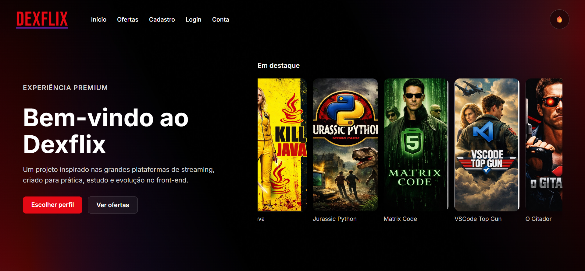
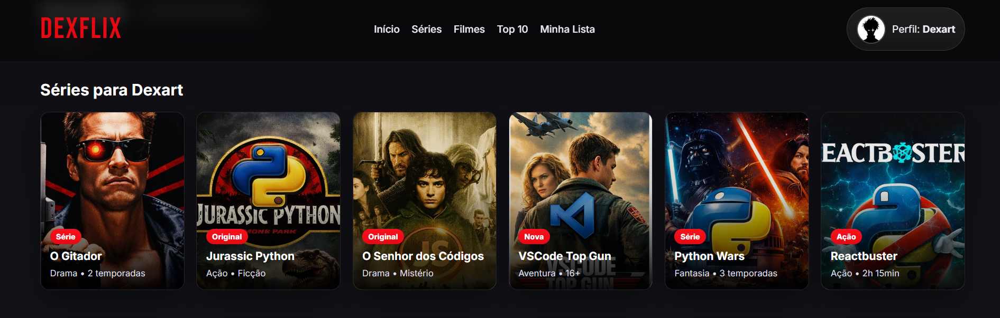

# 🎬 Dexflix

Interface web inspirada em plataformas de streaming, desenvolvida para praticar HTML, CSS e JavaScript com foco em design responsivo, experiência visual e interatividade no front-end.

---
## 📷 Preview



---

## 📌 Visão geral

O **Dexflix** é um projeto front-end inspirado na experiência visual de serviços de streaming.  
A aplicação simula uma plataforma com seleção de perfis, catálogo de filmes e séries, banner principal em destaque e modal com descrição dos conteúdos.

---

## 🚀 Funcionalidades

- Seleção de perfis
- Exibição dinâmica do nome e foto do perfil
- Catálogo de filmes e séries
- Banner principal com destaque visual
- Modal com resumo ao clicar nos conteúdos
- Navegação entre seções
- Layout responsivo

---

## 🛠️ Tecnologias utilizadas

- HTML5
- CSS3
- JavaScript
- Google Fonts
- Responsividade com Media Queries
- Manipulação do DOM

---

## 📷 Print



---

## ▶️ Como executar o projeto

1. Clone este repositório:

```bash
git clone https://github.com/SEU-USUARIO/SEU-REPOSITORIO.git